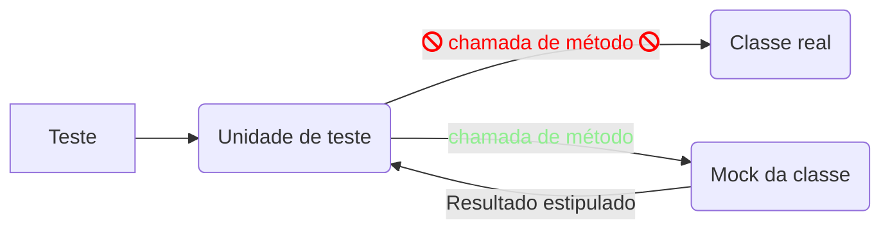

# Grupo 3

## Mocks

### O que são
  Mock é uma classe dublê que simula o comportamento das dependências de uma classe na realização de testes, substituindo-as quando se deseja testar um trecho de código separado do resto do sistema. 
  


### Quando usar
O uso de mock é mais relevante quando:
- Se deseja realizar testes unitários;
- Se deseja evitar o uso de dependências externas;
- Se deseja tornar o processo de testagem mais rápido com objetos mock; 
- Se sabe anteriormente o resultado do teste.
## A Ferramenta Mockito


### O que é
  [Mockito](https://site.mockito.org/) é um framework de mocking baseado em java, usado em conjunto com outros frameworks de teste como JUnit e TestNG. Utiliza internamente a API Java Reflection e permite replicar objetos de um seviço. Um objeto mock retorna dados simulados evitando dependências externas. Ele simplifica o desenvolvimento de testes através da simulação de dependencias e aplica o mock no código sob teste.
## Cookbook
### Pacotes (imports)
### Anotações e cláusulas
  Há importantes implementações para o funcionamento do Mockito, como a criação do Mock de fato, a atribuição de valores a funções da classe do Mock e outras.

- Criação do Mock:
    
  ```java 
  List mockList = Mock(List.class);
  ```
      
- Atribuição de valor a função do Mock:

  ```java 
  when(mockList.size()).thenReturn(10);
  ```
  
- Verificação se aquela função foi de fato chamada pela classe alvo de teste

  ```java 
  verify(mockList).size();
  ```

As anotações também são de estrema importancia no uso do mockito.

- *@Mock*
    
    Esta anotação tem como propósito facilitar a criação do mock, invés de utilizar a forma de criação descrita a cima utiliza-se a anotação.
      
    ```java 
    @Mock
    List mockList;
    ```

- *@Spy*
    
    Esta anotação funciona da mesma forma que o @Mock, mas cria uma classe Spy.
    
    ```java 
    @Spy
    List spyList;
    ```

- *@Captor*
    
    É usada para criar uma ArgumentCaptor instância que é usada para capturar os valores dos argumentos do método para outras asserções.
    
    ```java 
    @Captor
    ArgumentCaptor<String> keyCaptor;

    @Captor
    ArgumentCaptor<Integer> valueCaptor;
     ```

- *@InjectMocks*

    Com esta anotação uma classe real é criada, no entanto todos os seus objetos serão Mocks os quais serão criados por injeção de dependência se for possível.
    
    ```java 
    @InjectMocks
    private PessoaService pessoaService;
    ```

### Exemplos


  
### Testes Unitários e Mocks com Spring Rest Controller


    
-----------------------------------
